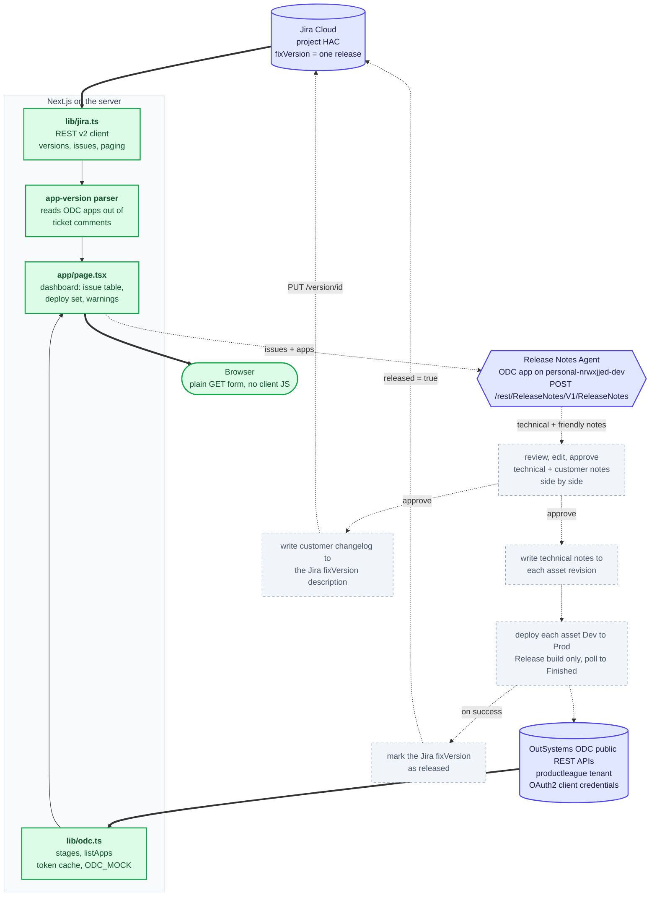
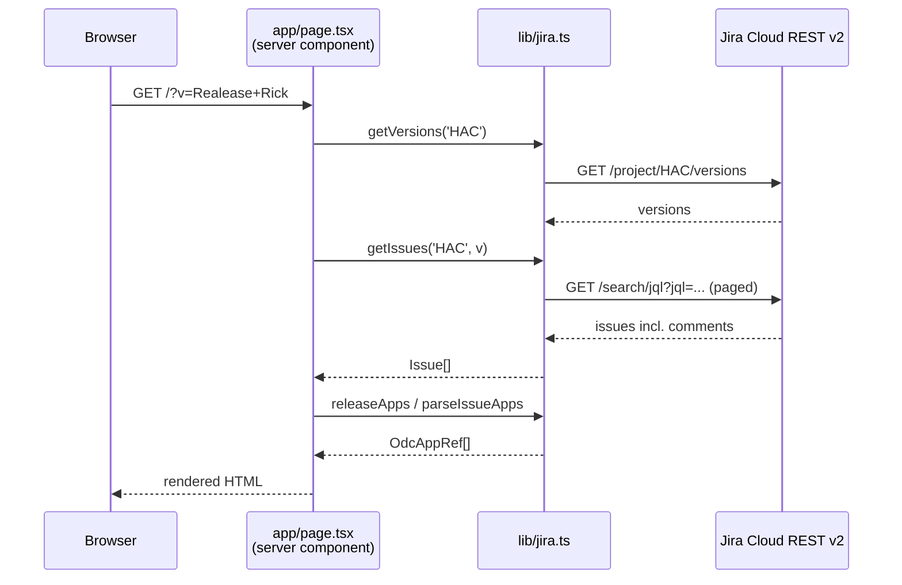

# Architecture

How this repo is put together, and why. Living document — it describes what exists
today, not the finished plan. For what's coming, see [milestones.md](./milestones.md).

## The whole system at a glance

Solid boxes and arrows exist in the repo today. Dashed ones do not. The three
external systems are all reachable and verified — it's the wiring between them and
the dashboard that isn't built.



The built portion is milestones 1 and 4. Everything dashed is 2, 3, 6 and 7, tracked
in [milestones.md](./milestones.md).

Note that **note generation is not in this repo**. It's an OutSystems agent app on a
different ODC tenant, exposed as one unauthenticated REST endpoint; the dashboard
POSTs tickets to it and renders what comes back. Its contract lives at
`https://personal-nrwxjjed-dev.outsystems.app/Releasenotesagent/rest/ReleaseNotes/swagger.json`.
That satisfies the brief's "agent to communicate with Jira" without an Anthropic key
in this codebase.

Approval fans out to four writes, not one: technical notes onto each ODC asset
revision, the customer changelog onto the Jira fixVersion description, the deploy
itself, and — only once the deploy reports `Finished` — marking the fixVersion
released in Jira. Marking released before a successful deploy would claim a release
that didn't happen.

Note also that the two ODC arrows point at the *same* tenant for reads and deploys
(`productleague`), but the agent lives on a *different* one (`personal-nrwxjjed-dev`),
so it never appears in `listApps()`.

## What the app does

Picks a release out of Jira, gathers the tickets in it, sends them to an OutSystems
agent that writes two kinds of release notes (technical and customer-facing), lets a
human review and approve them, then writes the technical notes onto each ODC asset
revision, the customer changelog onto the Jira fixVersion, and deploys the assets to
the next OutSystems ODC stage.

Built: the Jira read, the app parsing, and the ODC reads. Not built: everything from
"sends them to an agent" onward.

## Stack

| Piece | Choice | Notes |
|-------|--------|-------|
| Framework | Next.js 16, App Router | React 19, TypeScript |
| Styling | Tailwind CSS 4 | Via `@tailwindcss/postcss`, no config file |
| Data source | Jira Cloud REST API v2 | Basic auth, API token |
| Persistence | None, by decision | See "No persistence at all" below |
| Deploy target | Vercel | Not yet deployed |

No state library, no data-fetching library, no ORM, no component library, no test
framework. Everything below is plain TypeScript and React Server Components.

## Directory map

```
app/
  layout.tsx        Root layout, fonts, metadata (from create-next-app)
  page.tsx          The entire dashboard — one server component
  globals.css       Tailwind import + light/dark colour tokens
lib/
  jira.ts           Jira client + the ODC app-version parser
  jira.test.ts      Assertion script for the two bits of real logic
pm/
  milestones.md     Scope, status, decisions, open questions
  architecture.md   This file
.scratch/           Gitignored scratch space — probes, throwaway scripts, renders
.env.example        Which env vars are needed
```

That is the whole application. Four source files.

## How a request flows



Worth noticing what is *not* in that diagram: no API route, no client-side fetch, no
loading state, no JSON endpoint. The page is a server component that awaits its own
data and returns HTML. Selecting a release is a plain `<form>` doing a GET with
`?v=<version>`; Next re-renders the page on the server. Zero client-side JavaScript
runs for the current feature set.

`export const dynamic = 'force-dynamic'` keeps Next from trying to prerender a page
whose whole purpose is live data.

## The Jira layer (`lib/jira.ts`)

Everything that talks to Jira lives here. One private `jira(path)` helper does auth,
error wrapping, and JSON parsing; every exported function is a thin shape-mapper on
top of it.

**Why REST v2 and not v3.** v3 returns rich text as ADF (Atlassian Document Format),
a nested JSON tree we would have to walk to recover plain text. v2 returns
descriptions and comment bodies as plain strings, which is exactly what we need to
feed a language model. Using v2 deletes a whole ADF-flattening function.

**Why REST and not the Atlassian MCP server.** The brief asks for MCP, and MCP is used
during development in Claude Code. But that connection is authenticated by an
interactive OAuth session, which a server-side route on Vercel does not have. Wiring
MCP into the app's runtime data path means implementing Atlassian OAuth 3LO —
app registration, redirect URIs, token refresh. The dashboard reads Jira over REST
because that is what a server-side app does. The intended home for MCP is the *agent*
that interprets tickets, which is not built yet.

**Auth** is HTTP Basic with `email:api_token`, base64-encoded. Credentials are read
from `process.env` at call time (not module load) so a missing variable produces a
readable error in the UI rather than a crash at import. All three vars are
server-only — no `NEXT_PUBLIC_` prefix — so nothing reaches the browser.

**Pagination** is real. `getIssues` loops on `nextPageToken` until Jira stops
returning one, so a release larger than 100 issues works.

**JQL injection** matters because a Jira version name is user-controlled text that
gets interpolated into a query. `jqlString` quotes it. JQL escapes quotes and
backslashes exactly the way JSON does, so the implementation is `JSON.stringify` and
nothing else.

### The `Issue` type

A flattened projection of Jira's response — the fields we actually use, nothing else.
`done` is derived from the status *category* rather than the status name, because
status names are per-project configuration ("UAT PO Check", "Ready for development")
while the category is always one of To Do / In Progress / Done.

### The ODC app-version convention

A ticket declares which ODC app versions it touches in a **Jira comment**, as a
bulleted list under a header:

```
Outsytems apps in release:

-Hackathon Rick&Fran - Library
-Hackathon Rick&Fran - Restaurants
```

A ticket can name several app versions; different tickets may name the same one,
though usually they don't. Three functions read this:

- `parseIssueApps(issue)` — the app versions one ticket touches
- `releaseApps(issues)` — deduped union across the release; this is the deploy set
- `appsToIssues(issues)` — the reverse index, app version → tickets that touch it.
  This is what will group the technical release notes and provide traceability from
  each note back to its source tickets.

Two deliberate bits of sloppiness, both because they match reality better than
strictness would:

- **Header matching is loose** (`/apps\s+in\s+release|outs\w*\s+apps/i`) because the
  real comment in Jira says "Outsytems", misspelled. Being strict here would parse
  zero apps from live data.
- **App names may contain " - "** ("Hackathon Rick&Fran - Library"), so bullet parsing
  strips only the single leading marker and never splits on interior dashes.

**Version parsing is currently a guess**, flagged as such in the code. No comment in
Jira has a version yet, so there was nothing to build against. It recognises a
trailing dotted-numeric token, optionally prefixed with `v` or `@` — `MyApp 1.2`,
`MyApp v1.2.3`, `MyApp @ 2.0`. A lone integer is deliberately *not* a version, since
`Portal 2` is more likely part of a name. Everything in today's data therefore parses
as a bare app name with no version, which the UI badges amber. This blocks deployment
(you cannot deploy "some version") and is the highest-value open question.

The whole convention is expected to move to a Jira custom field later. When it does,
these three function bodies change and their return types do not, so nothing above
them needs touching. A configurator UI for the mapping is explicitly deferred.

## Design rules

These are choices, not accidents. Each one is a thing we decided *not* to build.

**No persistence at all.** *Agreed with Rick.* Not Postgres, not an ORM, and not a
JSON file on disk either. Issues come from Jira per request and notes from the ODC
agent per request; approval is client state in the review page. One session runs
generate → edit → approve → deploy, and a reload starts over.

Two reasons this is the cheapest correct answer rather than a corner cut. First,
there is very little to persist: which tickets are in a release is Jira's answer,
notes are regenerable, and deployment history belongs to ODC — the only genuinely
new state is one approval flag plus whatever text a human edited. Second, a JSON
file would not have worked in production anyway: the Vercel filesystem is ephemeral
and read-only outside `/tmp`, so `.data/` persists locally and silently does not
once deployed. Persistence is a lie or a KV store, and neither is worth it here.

Revisit if the demo needs approval to survive a reload, or if two people approve
concurrently. The upgrade is Vercel KV, a handful of lines, and nothing above it
changes.

**No platform-adapter interface.** There will be one implementation (ODC). An
interface with a single implementation is indirection, not abstraction. Demo safety
against a flaky tenant comes from an `ODC_MOCK=1` early return inside each function
instead — same protection, roughly no code. OutSystems 11 is out of scope entirely.

**No API routes.** Server components can await data directly. An API route would only
add a network hop, a second serialisation, and a loading state to manage.

**No note versioning.** When notes exist they will be current-content plus a status;
regenerating overwrites. Draft history is a feature nobody asked for.

**Hardcoded project.** `PROJECT = 'HAC'` is a const in `page.tsx`. The brief scopes
this to one board. Multi-project support is one const away when it's actually needed.

Shortcuts of this kind carry a `ponytail:` comment naming the ceiling and the upgrade
path, so a reader can tell deliberate simplicity from an oversight.

## Testing

`lib/jira.test.ts` is a plain assertion script — `node:assert/strict` and top-level
statements, run with `npx tsx lib/jira.test.ts`. No Jest, no Vitest, no config.

It covers the two things with real logic: JQL escaping (including the injection case
where a quote in a version name would otherwise break out of the string literal) and
the app-version parser (real HAC-7 comment as a fixture, dedup across tickets, the
`Portal 2` non-version case, markdown-escaped bullets). The fetch wrappers are not
tested — mocking HTTP to assert we call `fetch` proves nothing.

## Running it

```bash
npm install
cp .env.example .env.local     # then fill in JIRA_API_TOKEN
npm run dev                    # http://localhost:3000
npx tsx lib/jira.test.ts       # expects "jqlString ok" / "app parsing ok"
npx tsc --noEmit
```

Get a Jira API token at <https://id.atlassian.com/manage-profile/security/api-tokens>.

`npx tsc --noEmit` reports one error, `Cannot find name 'LayoutProps'` in
`app/layout.tsx`. That is create-next-app scaffolding depending on a type Next
generates into `.next/types`; it resolves once `next dev` or `next build` has run.

## Current state and gaps

Verified against live Jira: versions list, issue fetch, comment parsing. Both test
suites pass, typecheck is clean apart from the scaffolding error above.

**Not verified:** the rendered page. The dev server has not been run in this
environment, so the data layer is proven and the JSX is not.

**Doesn't exist yet:** any OutSystems integration, any language-model call, any
approval or persistence, any dispatch of notes, any authentication on the dashboard
itself.

**Known rough edges:**

- A misspelled fixVersion in the URL yields an empty release rather than an error,
  because `/search/jql` returns zero results instead of rejecting the unknown version.
  Easy to confuse with "release has no issues".
- `parseIssueApps` runs twice per table row in `page.tsx`. Pure and cheap, so it has
  been left alone rather than memoised.
- The dashboard is unauthenticated. Fine locally; not fine on a public Vercel URL,
  since it exposes Jira ticket contents to anyone with the link.
